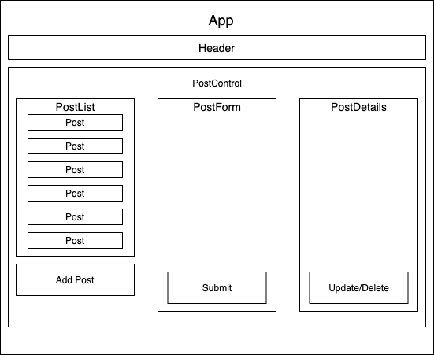

# Discussion Forum

#### **02/12/21**

## By Taylor Delph, Joey Giunta, & Callie Stump
<hr>

## **Description**
This is a website that recreates a basic subreddit and/or vote-based discussion board using React and Redux


## Known Bug
Posts arent organized by votes.

### **📖 User Stories**
<details>
<summary>Expand</summary>

* As a user, I want to enter content into a form and submit to create a new post.
* As a user, I want my new posts to include a timestamp. And I want to see when other listings were posted, too.
* As a user, I want to upvote posts I particularly enjoy.
* As a user, I want to downvote posts I don't like, or find inappropriate.
* As a user, I'd like posts with the most upvotes to appear higher on the page.
* **Further Exploration**: As a user, I want to click a post to view additional details.
</details>
<hr>

## **Diagram**


## **Setup**
1. Copy this download link: https://github.com/taylulz/disussion-forum.git
2. Create a project directory where you would like to store your cloned project.
3. Using bash/termianl, navigate to the cloned project folder.
```
$ cd Desktop
$ cd [known directory]
```
4. Clone the repo.
```
git clone "https://github.com/taylulz/disussion-forum.git"
```
5. Open your cloned project with VS code:
```
. code
```
6. Navigate to the VS terminal and download your dependencies with node.
```
npm install
```
7. If you wish to run a live server run the following code:
```
npm run start
```
8. To see if the program is functioning properly you can use:
```
npm run build
```
This will show you if everything is compiling correctly; if otherwise you be will prompt with error messages.

9. In order to run the tests for functionality, run the following code:
```
npm run test
```
#### Dont forget that in order to push any changes you need to add your own GitHub repo. to your project.
```
git remote add origin [repo. link]
```

## **Technologies Used**
* HTML
* CSS
* JavaScript
* Node
* REACT
* Redux
* React-Redux
* GIT
* GitHub
* .JSON


------------------------------
## 👥 Contributors

| Author | Email |
|--------|:-----:|
| [Callie Stump](https://www.linkedin.com/in/callie-stump/) | [callie@stu.mp](mailto:callie@stu.mp) |
| [Joseph Giunta](https://www.linkedin.com/in/giuntajoseph/) | [giuntajc@comcast.net](mailto:giuntajc@comcast.net) |
| [Taylor Delph](https://www.linkedin.com/in/taylordelph/) | [taylulzcode@gmail.com](mailto:taylulzcode@gmail.com) |
------------------------------

<!-- ## **Specs**
<details>
<summary>Expand Specs</summary>
<table>
  <tr>
    <th>Test</th>
    <th>Input</th>
    <th>Output</th>
    <th>Completed</th>
  </tr>
  <tr>
    <td></td>
    <td></td>
    <td></td>
    <td></td>
  </tr>    
  <tr>
    <td></td>
    <td></td>
    <td></td>
    <td></td>
  </tr>
  <tr>
    <td></td>
    <td></td>
    <td></td>
    <td></td>
  </tr>
  <tr>
    <td></td>
    <td></td>
    <td></td>
    <td></td>
  </tr>        
</table>   -->
 
## Legal
```
MIT License
Copyright (c) 2021 Taylor Delph, Joey Giunta, & Callie Stump

Permission is hereby granted, free of charge, to any person obtaining a copy of this software and associated documentation files (the "Software"), to deal in the Software without restriction, including without limitation the rights to use, copy, modify, merge, publish, distribute, sublicense, and/or sell copies of the Software, and to permit persons to whom the Software is furnished to do so, subject to the following conditions:

The above copyright notice and this permission notice shall be included in all copies or substantial portions of the Software.

THE SOFTWARE IS PROVIDED "AS IS", WITHOUT WARRANTY OF ANY KIND, EXPRESS OR IMPLIED, INCLUDING BUT NOT LIMITED TO THE WARRANTIES OF MERCHANTABILITY, FITNESS FOR A PARTICULAR PURPOSE AND NONINFRINGEMENT. IN NO EVENT SHALL THE AUTHORS OR COPYRIGHT HOLDERS BE LIABLE FOR ANY CLAIM, DAMAGES OR OTHER LIABILITY, WHETHER IN AN ACTION OF CONTRACT, TORT OR OTHERWISE, ARISING FROM, OUT OF OR IN CONNECTION WITH THE SOFTWARE OR THE USE OR OTHER DEALINGS IN THE SOFTWARE.
```
<center><a href="#">Return to Top</a></center>
